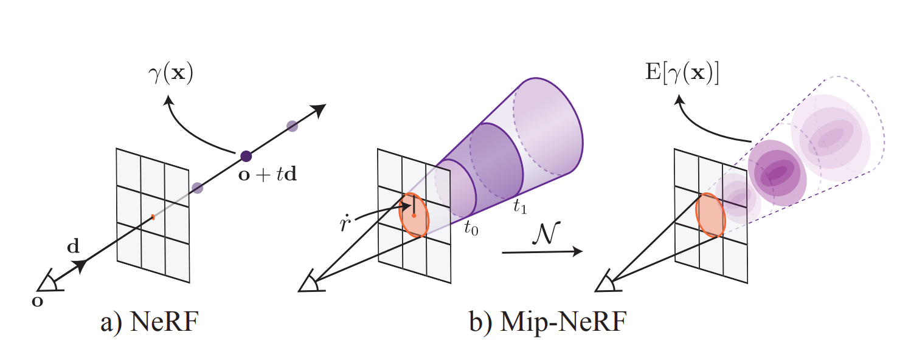

# Mip-NeRF

## 论文原文

[2021 ICCV *Mip-NeRF: A Multiscale Representation for Anti-Aliasing Neural Radiance Fields*](https://arxiv.org/abs/2103.13415) 

## 项目简介

* 该项目包含2021 ICCV Mip-NeRF论文原文 [[1](#1)] 及其复现源码，为读该论文后在[NeRF项目](https://github.com/mofashaoye/2020-ECCV-NeRF)基础上做出的更改，仅供参考！

* 该论文主要内容是对NeRF模型[[2](#2)]的一个改进，受mipmap启发用cone-casting替换了原有得ray-casting，且采用了IPE而不是PE的编码方式，让NeRF在更加自然且具有挑战性的数据集上（分辨率不唯一）也能表现得很好。

* 该项目主要做了mip-NeRF在NeRF的原始合成图像数据集[Blender Dataset](https://drive.google.com/drive/folders/128yBriW1IG_3NJ5Rp7APSTZsJqdJdfc1)上的几个场景的训练和测试，同时与NeRF项目中在该数据集上的表现做了一定的对比，此外在多分辨率数据集 Multiscale Blender Dataset [[1](#1)] 上也做了复现。由于NeRF项目当时为了显存以及训练速率对原始数据集分辨率做了调整，将 $lego$ 场景 $800\times800\times3$ （Full Res）的图像下采样为了 $400\times400\times3$ （Res $1/2$ ），因此该项目不仅复现了Full Res的 $lego$ 等，同时复现了Res $1/2$ 的 $lego$ 。

## 环境与配置

* OS操作系统：Linux Ubuntu 18.04.4 LTS (GNU/Linux 4.15.0-180-generic x86_64)
* GPU显卡资源：Tesla V100-SXM2-32GB
* CUDA版本：11.4
* Python版本：3.8.12
* torch版本：1.9.0+cu102
* torchvision版本：0.10.0+cu102
* cudnn版本：8.2.4

其他Python模块依赖
```
tqdm
opencv-python
scikit-image==0.19.3
```

## 3D场景可视化

以下展示的是该项目中Mip-NeRF在单一分辨率Blender Dataset数据集上对场景重建后的可视化以及测试集的可视化

<table>
<tr>
    <th> Scene </th> <th>Ground Truth</th> <th>Predict</th>
</tr>
<tr>
<td> lego </td> <td width=50%></td><td width=50%> </td>
</tr>
<tr>
<tr>
<td> materials </td> <td width=50%></td><td width=50%> </td>
</tr>
<tr>
</table>

表 1：Mip-NeRF在单一分辨率Blender Dataset数据集上对场景重建后的可视化以及测试集的可视化

## 方法

该论文导致比NeRF模型[[2](#2)]表现好的核心因素即为采用了ConeTracing和IPE，具体如下（左侧为NeRF模型，右侧为Mip-NeRF模型）：

1. **投射的光线变化** 每个像素投射单根光线的RayTracing $\Longrightarrow$ 每个像素投射一个锥体的ConeTracing

2. **采样的变化** 每根ray上采样点 $t=t_i$ $\Longrightarrow$ 每个cone上采样conical frustum （ $t\in[t_i, t_{i+1}]$ ）

3. **位置编码的变化** 对单个点的位置进行位置编码（PE） $\Longrightarrow$  对每个conical frustum区域位置进行综合位置编码（IPE）

4. **模型及损失函数的变化** $\min\limits_{\Theta^c,\Theta^f}{\sum\limits_{r\in{\mathcal{R}}}{\left(\left\Vert{\mathbf{C}^*\left(\mathbf{r}\right)-\mathbf{C}\left(\mathbf{r};\Theta^c,\mathbf{t}^c\right)}\right\Vert_2^2+\left\Vert{\mathbf{C}^*\left(\mathbf{r}\right)-\mathbf{C}\left(\mathbf{r};\Theta^f,sort\left(\mathbf{t}^c\cup{\mathbf{t}^f}\right)\right)}\right\Vert_2^2\right)}}$ $\Longrightarrow$ $\min\limits_{\Theta}{\sum\limits_{r\in{\mathcal{R}}}{\left(\lambda\left\Vert{\mathbf{C}^*\left(\mathbf{r}\right)-\mathbf{C}\left(\mathbf{r};\Theta,\mathbf{t}^c\right)}\right\Vert_2^2+\left\Vert{\mathbf{C}^*\left(\mathbf{r}\right)-\mathbf{C}\left(\mathbf{r};\Theta,\mathbf{t}^f\right)}\right\Vert_2^2\right)}}$ 

图1： NeRF和Mip-NeRF [[1](#1)]</img>

<br>

具体怎么对conical frustum区域进行IPE，简略介绍如下：

首先通过Cone-Casting得到了如图1中b)所示的 $[t_0,t_1]$ 区域的conical frustum，然后通过三维高斯分布估计该区域的点的位置分布（因为原本的位置分布的闭式解求解较为困难），该三维高斯分布由以下均值和方差表征

$$
\mathbf{\mu}=\mathbf{o}+\mu_t\mathbf{d},\ \ \ \ \mathbf{\Sigma}=\sigma_t^2\left(\mathbf{d}\mathbf{d^T}\right)+\sigma_r^2\left(\mathbf{I}-\frac{\mathbf{d}\mathbf{d^T}}{\left\Vert{\mathbf{d}}\right\Vert_2^2}\right) \tag{1}
$$

其中

$$
\mu_t=t_{\mu}+\frac{2t_{\mu}t_{\delta}^2}{3t_{\mu}^2+t_{\delta}^2}, \ \ \ \ \sigma_t^2=\frac{t_{\delta}^2}{3}-\frac{4t_{\delta}^4\left(12t_{\mu}^2-t_{\delta}^2\right)}{15\left(3t_{\mu}^2+t_{\delta}^2\right)^2}, \ \ \ \ \sigma_r^2=\dot{r}^2\left(\frac{t_{\mu}^2}{4}+\frac{5t_{\delta}^2}{12}-\frac{4t_{\delta}^4}{15\left(3t_{\mu}^2+t_{\delta}^2\right)}\right). \tag{2}
$$

$$
t_{\mu}=\frac{\left(t_0+t_1\right)}{2}, \ \ \ \ t_{\delta}=\frac{\left(t_1-t_0\right)}{2}. \tag{3}
$$

然后对以 $\mathbf{\mu}$ 为均值以 $\mathbf{\Sigma}$ 为方差的分布PE编码

$$
\mathbf{\mu_{\gamma}}=\mathbf{P}\mathbf{\mu}, \ \ \ \ \mathbf{\Sigma_{\gamma}}=\mathbf{P}\mathbf{\Sigma}\mathbf{P^T} .\tag{4}
$$

$$
\gamma\left(\mathbf{\mu},\mathbf{\Sigma}\right)=E_{\mathbf{x}\sim{\mathcal{N}}\left(\mathbf{\mu_{\gamma}},\mathbf{\Sigma_{\gamma}}\right)}\left[\gamma\left(\mathbf{x}\right)\right]=\begin{bmatrix} 
\sin\left(\mathbf{\mu_{\gamma}}\right)\otimes\exp\left(-\left(1/2\right)\mathrm{diag}\left(\mathbf{\Sigma_{\gamma}}\right)\right) \\ 
\cos\left(\mathbf{\mu_{\gamma}}\right)\otimes\exp\left(-\left(1/2\right)\mathrm{diag}\left(\mathbf{\Sigma_{\gamma}}\right)\right)
\end{bmatrix}\tag{5}
$$

其中 $\mathbf{P}=\begin{bmatrix} \mathbf{I} & 2\mathbf{I} & \cdots & 2^{L-1}\mathbf{I}\end{bmatrix}^T$ ， $\otimes$ 表示哈达玛积（对应元素相乘）

又由于公式5中只用到了 $\mathbf{\Sigma_{\gamma}}$ 的对角线，因此可以公式可以优化为

$$
\mathbf{\mu}=\mathbf{o}+\mu_t\mathbf{d},\ \ \ \ \mathrm{diag}\left(\mathbf{\Sigma}\right)=\sigma_t^2\left(\mathbf{d}\otimes\mathbf{d}\right)+\sigma_r^2\left(\mathbf{I}-\frac{\mathbf{d}\otimes\mathbf{d}}{\left\Vert{\mathbf{d}}\right\Vert_2^2}\right) \tag{6}
$$

$$
\mathbf{\mu_{\gamma}}=\mathbf{P}\mathbf{\mu}, \ \ \ \ \mathrm{diag}\left(\mathbf{\Sigma_{\gamma}}\right)=\mathbf{P}^2\mathrm{diag}\left(\mathbf{\Sigma}\right).\tag{7}
$$

$$
\gamma\left(\mathbf{\mu},\mathbf{\Sigma}\right)=E_{\mathbf{x}\sim{\mathcal{N}}\left(\mathbf{\mu_{\gamma}},\mathbf{\Sigma_{\gamma}}\right)}\left[\gamma\left(\mathbf{x}\right)\right]=\begin{bmatrix} 
\sin\left(\mathbf{\mu_{\gamma}}\right)\otimes\exp\left(-\left(1/2\right)\mathrm{diag}\left(\mathbf{\Sigma_{\gamma}}\right)\right) \\ 
\cos\left(\mathbf{\mu_{\gamma}}\right)\otimes\exp\left(-\left(1/2\right)\mathrm{diag}\left(\mathbf{\Sigma_{\gamma}}\right)\right)
\end{bmatrix}\tag{8}
$$

至于 $\mu_t$ 、$\sigma_t^2$ 、 $\sigma_r^2$ 与 $t_0$ 、 $t_1$ 的关系推导可以假设为均匀分布然后通过三重积分计算出 $t$ 的一阶原点矩以及二阶原点距从而求出 $t$ 的均值方差；再计算出 $x$ 的二阶原点矩，根据 $x$ 的方差和 $r$ 的方差相等且 $x$ 的一阶原点矩为0（对称性）从而求出 $r$ 的二阶中心矩（即方差）。

## 数据集

Blender Dataset同NeRF项目，Multiscale Blender Dataset则在此基础上增加了按2、4、8倍数下采样的图像。

## 结果

| Framework | Model | Res | PSNR $\uparrow$ | SSIM $\uparrow$ |
| --- | --- | --- | --- | --- |
| PyTorch(GPU) | NeRF(NeRF项目) | $1/2$ | 31.440 | 0.9750 |
| PyTorch(GPU) | mip-NeRF(该项目) | $1/2$ | 34.078 | 0.9855 |
| PyTorch(GPU) | mip-NeRF(该项目) | $1$ | 32.657 | 0.9771 |
表2：NeRF与mip-NeRF在原始单一分辨率数据集Blender Dataset中lego场景上结果比较

<br>

| Framework | Model | Res | avgPSNR $\uparrow$ | avgSSIM $\uparrow$ |
| --- | --- | --- | --- | --- | 
| PyTorch(GPU) | mip-NeRF(该项目) | $1,1/2,1/4,1/8$ | 33.553 | 0.9808 |
| Jax(TPU) | NeRF(论文[[1](#1)]) | $1,1/2,1/4,1/8$ | 27.748 | 0.9256 |
| Jax(TPU) | NeRF + Area, Center, Misc.(论文[[1](#1)]) | $1,1/2,1/4,1/8$ | 31.646 | 0.9646 |
| Jax(TPU) | mip-NeRF(论文[[1](#1)]) | $1,1/2,1/4,1/8$ | 35.736 | 0.9843 |

表3：NeRF与mip-NeRF在多分辨率数据集Multiscale Blender Dataset中lego场景上结果比较

从表1定性来看，mip-NeRF上重建的场景和Ground Truth差别较小，尤其是 $lego$ 场景，效果很好。

从表2定量来看，ConeTracing和IPE的使用，使得NeRF项目中的NeRF表现更佳了。

从表3定量来看该项目mip-NeRF在multi-lego数据集（Multiscale Blender Dataset中的lego场景）上和论文中Jax框架实现的NeRF相比，即使NeRF采用了许多优化依旧完全比不过mip-NeRF，这也充分体现了mip-NeRF在多分辨率数据集上的优越性；但是和论文中的Jax框架实现的mip-NeRF的结果相差较大，我认为可能有两点原因。第一点，我由于显卡算力原因在multi-lego数据集上迭代次数只有20w，而该论文则采用了100w，结合损失函数曲线来看，我的模型可能没有收敛完全；第二点则是结合NeRF论文中tensorflow框架实现的NeRF[[2](#2)]来看，Jax框架可能底层有一些优化，使它无论在速率还是精度上都略优于其他深度学习框架。


## 参考文献

<a id="1"></a> [1] Jonathan T. Barron, Ben Mildenhall, Matthew Tancik, Peter Hedman, Ricardo Martin-Brualla and Pratul P. Srinivasan. &nbsp; Mip-NeRF: A Multiscale Representation for Anti-Aliasing Neural Radiance Fields. &nbsp; *ICCV*, 2021.

<a id="2"></a> [2] Ben Mildenhall, Pratul P. Srinivasan, Matthew Tancik, Jonathan T. Barron, Ravi Ramamoorthi, and Ren Ng. &nbsp; NeRF: Representing scenes as neural radiance fields for view synthesis. &nbsp; *ECCV*, 2020.